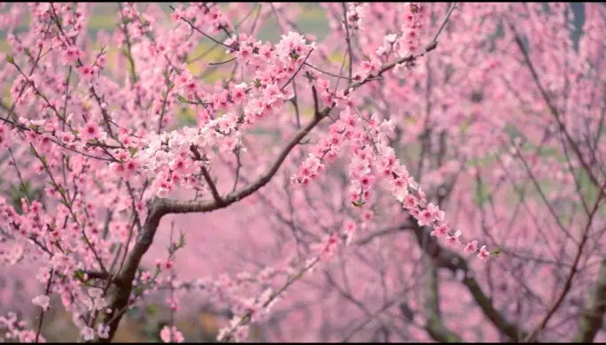
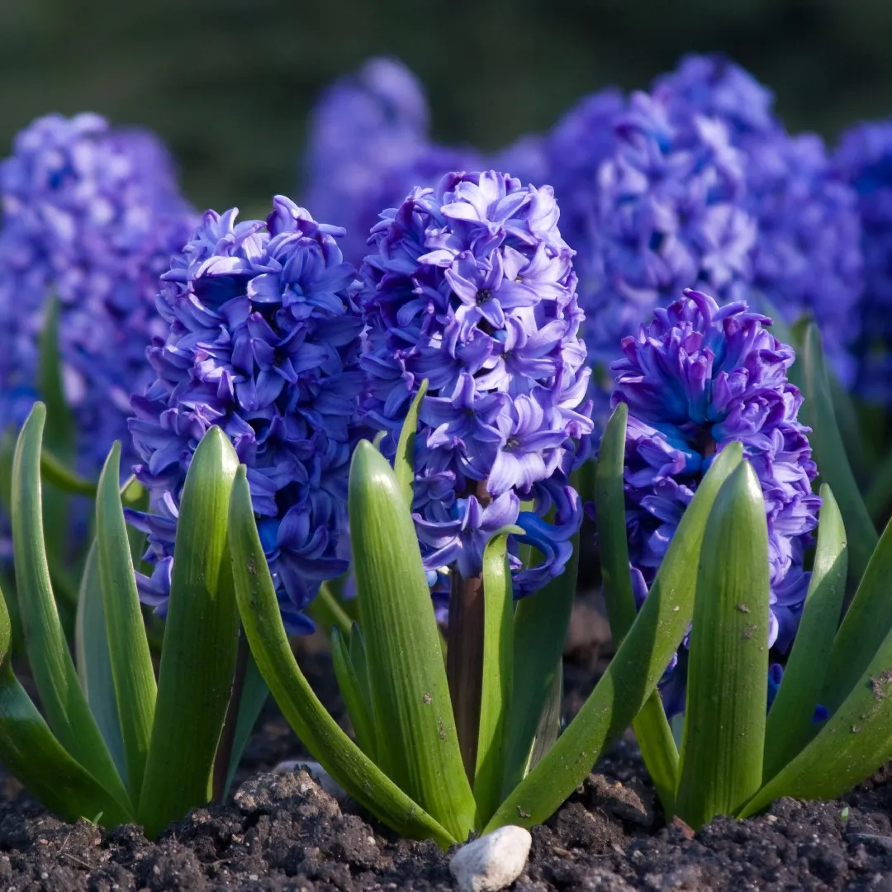

## 植物篇

### 篇一 桃花

> 阅读时间：2025年3月第1周
> 
> 思考问题：
> 1. 文章分了几段？描写的植物是什么？（桃花）
> 2. 文章先写了什么，再写了什么，最后写了什么？（结构顺序）
> 3. 作者最想告诉我们桃花有什么特点？（中心思想）
> 4. 找出文中把桃花比作其他东西的句子（比如比作海洋、浪花）（比喻手法）
> 5. 作者用哪些感官来描写桃花？（眼睛看、鼻子闻、手触摸）
> 6. 从哪里能看出作者特别喜欢桃花？（表达喜爱的句子）

&emsp;&emsp; 春天，一朵朵粉色的，小小的桃花从树上长出来，一眼望去就像粉色的海洋。轻风吹过，桃花树左右摇摆，像一朵朵奔腾的浪花，轻风停止了，浪花也就停止了。阳光洒落在桃花上，桃花就变成了金黄色的了。

&emsp;&emsp; 走进桃花林，我才看清桃花的叶是椭圆状披针形，叶缘有粗锯齿。手一滑，就会画出一条白色的条纹。花瓣有白色的，像积雪；有红色的，像一盏盏灯笼；有粉色的，像小坠子。一阵风吹过来，一阵清香从我鼻子前飘过，我真想把这一股清香永远留在身边。

&emsp;&emsp; 忽然，天空下着桃花雨。我往后一转，原来是妈妈在摇着树，桃花慢慢地落下来，这时，仿佛我也变成了一朵桃花，在跟着其它桃花玩着捉迷藏。我们落在了地上，把大地染成了粉红的。人们拿起一朵朵桃花，正往头上放呢，轻风一吹，桃花被吹到了小河中，大树摆摆手臂，好像在欢迎我们的到来。小兔子正在蹦蹦跳跳的玩耍，小鹿弯下腰，在喝水，桃花也把小河染成了粉红色，我们飘呀飘，看见了许多小动物在河里打闹，小鱼在比赛游泳。

&emsp;&emsp; 桃花真是太美丽了。

### 篇二 风信子

> 阅读时间：2025年3月第2周
> 
> 思考问题：
> 1. 文章分了几段？描写的植物是什么？（风信子）
> 2. 文章先写了什么，再写了什么，最后写了什么？（结构顺序）
> 3. 作者最想告诉我们风信子有什么特点？（中心思想）
> 4. 找出文中把风信子比作其他东西的句子（比如比作海洋、浪花）（比喻手法）
> 5. 作者用哪些感官来描写风信子？（眼睛看、鼻子闻、手触摸）
> 6. 从哪里能看出作者特别喜欢风信子？（表达喜爱的句子）

&emsp;&emsp; 我有一个植物朋友，它的学名叫“风信子”。我叫它“会开花的洋葱”，因为它的茎看起来像一个紫色的洋葱。我的植物朋友风信子在还没有长出叶子的时候，它的茎呈球形，球形的茎下长出了一大把长长的、白白的根，像一把白色的大刷子。

&emsp;&emsp; 过了一段时间，风信子长出了碧绿碧绿的叶子，它的叶子呈长条形，就像大蒜苗一样。叶子的顶端尖尖的，像我们的小手指尖。叶子的肉厚厚的，用手摸上去很厚实。叶脉呈深绿色，上面的许多竖条纹。叶柄为浅绿色，稍微带了一点儿黄色。

&emsp;&emsp; 我的风信子开的是紫色的花，绿叶的中央冒出一根粗粗的柱子，一朵朵紫色的花把柱子的顶端团团围住。这些花像一个个紫色的小喇叭，一到早晨，就朝着四面八方叫着：“起床啦！起床啦！我的小主人，起床啦！太阳晒* 股啦！“我睁开矇眬的睡眼，闻到一股浓浓的花香味，原来是我风信子正在用香味催我起床呢！

&emsp;&emsp; 我的植物朋友就是这么奇妙，你喜欢吗？

### 篇三

### 篇四

### 篇五

### 篇六

### 篇七

### 篇八

### 篇九

### 篇十

## 动物篇
### 篇一

### 篇二

### 篇三

### 篇四

### 篇五

### 篇六

### 篇七

### 篇八

### 篇九

### 篇十

## 人物篇

### 篇一

### 篇二

### 篇三

### 篇四

### 篇五

### 篇六

### 篇七

### 篇八

### 篇九

### 篇十
