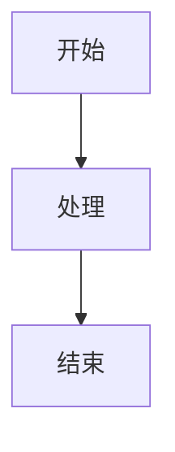

--- 
title: 语法记录
---

## 参考文档

[Markdown 练习](https://www.markdowntutorial.com/zh-cn/)  
[Mrkdown 作者的博客](https://daringfireball.net/projects/markdown/)

## 换行的两种方式

在markdown中，换行有两种方式：

### 段落内换行

在段落中，使用两个空格（`  `）

测试换行  
我是另一行

### 段落间换行

在段落间，使用一个换行符（`\n`）

测试换行  

我是另一行

## 链接的两种方式

### 行内链接

这是一个行内[链接示例](https://www.markdown.xyz/basic-syntax/#links)

### 全局链接

这是一个全局[链接示例][链接示例]

[链接示例]: https://www.markdown.xyz/basic-syntax/#links

## 图片的两种方式

### 行内图片

这是一个行内图片

### 全局图片

这是一个全局图片![图片示例][图片示例]

[图片示例]: ./image.avif

## 内容目录

### 自动生成目录

```markdown
[[toc]]
```

[[toc]]

## LaTeX 公式

### 行内公式

这是一个行内公式：$E=mc^2$

### 块级公式

这是一个块级公式：

$$
E=mc^2
$$

## 流程图



示例


graph TD
A[开始] --> B[处理]
B --> C[结束]

## Todo 列表

- [ ] 完成任务
- [x] 已完成任务
- [ ] 待办任务

## 甘特图

```mermaid
gantt
date格式 YYYY-MM-DD
title 甘特图

```

## HTML 标签

```html
<div>
    <p>这是一个HTML标签</p>
</div>
```

示例

<div>
    <p>这是一个HTML标签</p>
</div>

## 强调

==强调==
